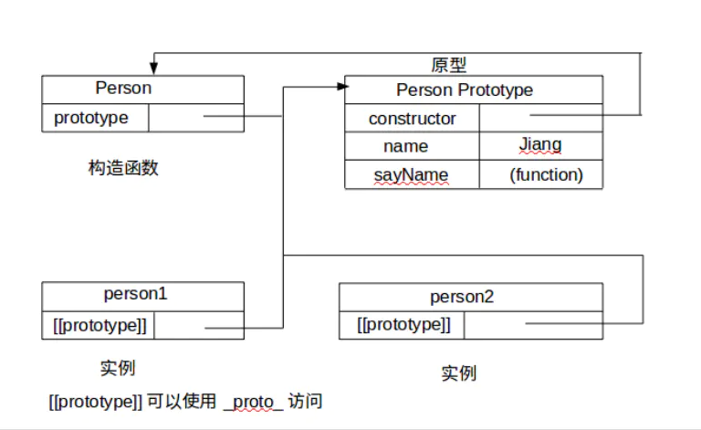
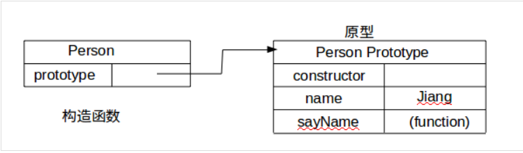
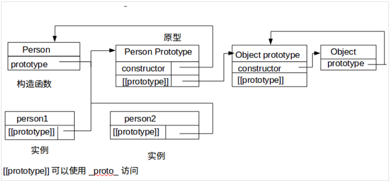

[参考文档](https://www.jianshu.com/p/7d58f8f45557)


\*

如果能看懂图中的关系基本上就可以解释出*proto*和 prototype 的关系和区别了
所以接下来一一介绍图中的一些概念

> ### 构造函数

使用构造函数创建对象

```
    function Person() {}
    Person.prototype.name = 'king'
    const person1 = new Person()
    console.log(person1.name, '----person1.name-----')
    //king
    console.log(Person.prototype, 'Person.prototype')
    //{name: "king", constructor: ƒ}
```

Person 就是一个构造函数，通过 new 创建了 person1 对象实例

> ### prototype

图中可以看到在 Person 构造函数下有一个 prototype 属性。

这个并不是构造函数专有，**每个函数都会有一个 prototype 属性，这个属性是一个指针，指向一个对象，记住只有函数才有,并且通过 bind()绑定的也没有。**

prototype 属性指向一个对象，那么这个对象是什么？

根据第一张图片可以清晰看到，prototype 指向 Person.prototype。没错 Person.prototype 就是原型对象，也就是实例 person1 和 person2 的原型。

**原型对象的好处是可以让所有对象实例共享它所包含的属性和方法**

所以构造函数和原型之间的关系为



> ### proto
>
> 第一张图中看到，在 person1 和 person2 实例对象下面有一个[[prototype]],其实没有标准的方式可以访问它，但是主流浏览器上在**每个对象上(null 除外)都支持一个属性,那就是 proto，这个属性会指向该对象的原型**

```
    function Person() {}
    Person.prototype.name = 'king'
    const person1 = new Person()
    console.log(person1.__proto__ ===Person.prototype, '----prototype-----')
```

```
console.log(
    person1.constructor === Person,
    '----person1.constructor === Person-----'
)
```

那岂不是实例 person1 也有.constructor 属性，其实没有，通过原型链在原型 Person.prtototype 上面找到的
理顺了这层关系，第一张图就全部理解完了，是不是差不多就可以解释出 proto 和 prototype 的关系和区别呢

> **原型链**
> 我们既然探索完了他们的关系，那我们来继续探索一下原型和原型链的奥秘所在，其实原型链就是依托 proto 和 prototype 连接起来的

```
 function Person() {}
      // 原型属性
      Person.prototype.name = 'king'
      const person1 = new Person()
      // 实例属性
      person1.name = '周小熊'
      console.log(person1.name, '-person1.name-----')//周小熊
```

上面代码中在实例属性和原型属性都有一个名为 name 的属性，但是最后输出来的是实例属性上的值

当我们读取一个属性的时候，如果在实例属性上找到了，就读取它，不会管原型属性上是否还有相同的属性，这其实就是**属性屏蔽**。

即当实例属性和原型属性拥有相同名字的时候，实例属性会屏蔽原型属性，记住只是屏蔽，不会修改，原型属性那个值还在

但是如果在实例属性上没有找到的话，就会在实例的原型上去找，如果原型上还没有，就继续到原型的原型上去找，直到尽头，这个尽头是啥？不急，等会说

```
 function Person() {}
      // 原型属性
      Person.prototype.name = 'king'
      const person1 = new Person()
      // 实例属性
      console.log(person1.name, '-person1.name-----') //king
```

上面代码中 person1 实例并没有 name 属性，但仍然可以输出值，就是在原型上找到的

如何检测一个属性存在于实例中，还是原型中？
**使用方法 hasOwnProperty,属性只有存在于实例中才会返回 true**
in 则会遍历所有属性

```
person1.hasOwnProperty('name')

'name' in person1
```

Object.prototype 有原型吗？

```
 Object.prototype.__proto__ //null
```

没有，为 null，所以它就是前面所提到的尽头


